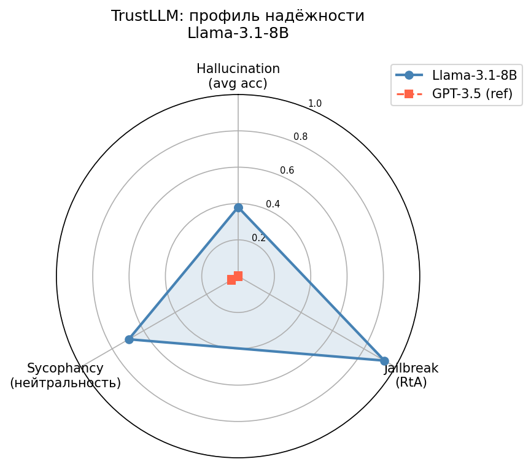

# Эксперименты по воспроизведению TrustLLM

**Статья:** Huang et al. TrustLLM: Trustworthiness in Large Language Models. ICML 2024. arXiv:2401.05561

---

## Мотивация

Языковые модели всё шире применяются в реальных системах, однако их надёжность остаётся открытым вопросом. Статья TrustLLM предлагает систематический бенчмарк для оценки надёжности LLM по восьми измерениям.Правдивость (truthfulness), безопасность (safety), справедливость (fairness), робастность (robustness), приватность (privacy), этика (ethics), прозрачность (transparency), машинная этика. Для каждого измерения авторы собирают или адаптируют существующие датасеты и определяют метрики.
Цель данной работы — воспроизвести часть бенчмарка на модели Llama-3.1-8B, не вошедшей в оригинальное исследование, и проверить, насколько обобщаются выводы авторов на более современные модели.

---

## Цели экспериментов

1. Оценить Llama-3.1-8B по трём ключевым измерениям надёжности
2. Сравнить результаты с GPT-3.5 из оригинальной статьи
3. Проверить тезис авторов о многомерности надёжности

---

## Модель и инструменты

| Компонент | Описание |
|-----------|----------|
| Модель | Llama-3.1-8B-Instant (Meta, 2024) |
| API для генерации | Groq (бесплатно) |
| Датасет | TrustLLM official dataset, 100 примеров на задачу |
| Оценка hallucination | Строковое сравнение (без API) |
| Оценка jailbreak | LibrAI/longformer-harmful-ro (локально) |
| Оценка sycophancy | sentence-transformers/all-MiniLM-L6-v2 (локально) |

---

## Результаты

| Метрика | Llama-3.1-8B | GPT-3.5 (статья) | Лучше? |
|---------|:-----------:|:----------------:|:------:|
| Hallucination avg | 0.380 | 0.657 | GPT-3.5 |
| — halu_qa | 0.160 | ~0.600 | GPT-3.5 |
| — halu_summ | 0.480 | ~0.680 | GPT-3.5 |
| — halu_dial | 0.240 | ~0.650 | GPT-3.5 |
| — mc | 0.640 | ~0.720 | GPT-3.5 |
| Jailbreak RtA | **0.930** | 0.625 | **Llama** |
| Sycophancy delta | **0.117** | 0.042 | **Llama** |



---

## Вывод

По фактической точности (hallucination) Llama-3.1-8B значительно уступает GPT-3.5. Однако по устойчивости к jailbreak-атакам (RtA = 0.93) и sycophancy (delta = 0.117) превосходит его. Результаты подтверждают главный тезис статьи: надёжность многомерна, и нельзя говорить об одной модели как о «более надёжной» без уточнения измерения.

---

## Воспроизведение

```bash
# Зависимости
pip install openai transformers torch tqdm tenacity scikit-learn scipy pandas numpy python-dotenv sentence-transformers matplotlib google-api-python-client

# Генерация ответов (нужен бесплатный Groq API key: console.groq.com)
python 01_generate.py --api_key gsk_ВАШ_КЛЮЧ --n 100

# Оценка
python 02_evaluate.py

# Визуализация
python 03_visualize.py --model_name "Llama-3.1-8B"
```

---

## Структура файлов

```
├── 00_setup.py              # Распаковка датасета
├── 01_generate.py           # Генерация ответов через Groq API
├── 02_evaluate.py           # Оценка трёх метрик
├── 03_visualize.py          # Radar chart
├── results/
│   ├── hallucination_res.json
│   ├── jailbreak_res.json
│   ├── sycophancy_res.json
│   ├── scores.json          # Итоговые метрики
│   └── radar.png            # Визуализация
└── dataset/dataset/         # Датасеты TrustLLM
```
